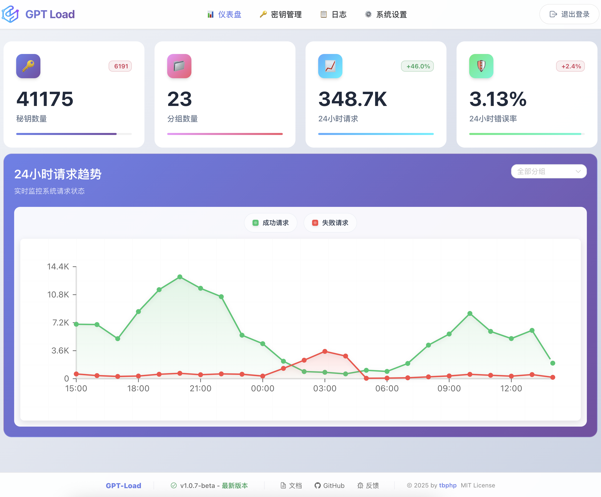

# GPT-Load

中文文档 | [English](README_EN.md)

[](https://github.com/tbphp/gpt-load/releases)


一个高性能、企业级的 AI 接口透明代理服务，专门为需要集成多种 AI 服务的企业和开发者设计。采用 Go 语言开发，具备智能密钥管理、负载均衡和完善的监控功能，专为高并发生产环境而设计。

详细请查看[官方文档](https://www.gpt-load.com/docs)

## 功能特性

- **透明代理**: 完全保留原生 API 格式，支持 OpenAI 和 Google Gemini 等多种格式（持续扩展中）
- **智能密钥管理**: 高性能密钥池，支持分组管理、自动轮换和故障恢复
- **负载均衡**: 支持多上游端点的加权负载均衡，提升服务可用性
- **智能故障处理**: 自动密钥黑名单管理和恢复机制，确保服务连续性
- **动态配置**: 系统设置和分组配置支持热重载，无需重启即可生效
- **企业级架构**: 分布式主从部署，支持水平扩展和高可用
- **现代化管理**: 基于 Vue 3 的 Web 管理界面，直观易用
- **全面监控**: 实时统计、健康检查、详细请求日志
- **高性能设计**: 零拷贝流式传输、连接池复用、原子操作
- **生产就绪**: 优雅关闭、错误恢复、完善的安全机制

## 支持的 AI 服务

GPT-Load 作为透明代理服务，完整保留各 AI 服务商的原生 API 格式：

- **OpenAI 格式**: 官方 OpenAI API、Azure OpenAI、以及其他 OpenAI 兼容服务
- **Google Gemini 格式**: Gemini Pro、Gemini Pro Vision 等模型的原生 API
- **扩展性**: 插件化架构设计，可快速集成新的 AI 服务提供商及其原生格式

## 快速开始

### 环境要求

- Go 1.23+ (源码构建)
- Docker (容器化部署)
- MySQL, PostgreSQL, 或 SQLite (数据库存储)
- Redis (缓存和分布式协调，可选)

### 方式一：使用 Docker Compose（推荐）

**安装命令：**

```bash
# 创建目录
mkdir -p gpt-load && cd gpt-load

# 下载配置文件
wget https://raw.githubusercontent.com/tbphp/gpt-load/refs/heads/main/docker-compose.yml
wget -O .env https://raw.githubusercontent.com/tbphp/gpt-load/refs/heads/main/.env.example

# 启动服务
docker compose up -d
```

默认安装的是 SQLite 版本，适合轻量单机应用。

如需安装 MySQL, PostgreSQL 及 Redis，请在 `docker-compose.yml` 文件中取消所需服务的注释，并配置好对应的环境配置重启即可。

**其他命令：**

```bash
# 查看服务状态
docker compose ps

# 查看日志
docker compose logs -f

# 重启服务
docker compose down && docker compose up -d

# 更新到最新版本
docker compose pull && docker compose down && docker compose up -d
```

部署完成后：

- 访问 Web 管理界面：<http://localhost:3001>
- API 代理地址：<http://localhost:3001/proxy>

> 使用默认的认证 Key `sk-123456` 登录管理端，认证 Key 可以在 .env 中修改 AUTH_KEY。

### 方式二：源码构建

源码构建需要本地已安装数据库（SQLite、MySQL 或 PostgreSQL）和 Redis（可选）。

```bash
# 克隆并构建
git clone https://github.com/tbphp/gpt-load.git
cd gpt-load
go mod tidy

# 创建配置
cp .env.example .env

# 修改 .env 中 DATABASE_DSN 和 REDIS_DSN 配置
# REDIS_DSN 为可选，如果不配置则启用内存存储

# 运行
make run
```

部署完成后：

- 访问 Web 管理界面：<http://localhost:3001>
- API 代理地址：<http://localhost:3001/proxy>

> 使用默认的认证 Key `sk-123456` 登录管理端，认证 Key 可以在 .env 中修改 AUTH_KEY。

### 方式三：集群部署

集群部署需要所有节点都连接同一个 MySQL（或者 PostgreSQL） 和 Redis，并且 Redis 是必须要求。建议使用统一的分布式 MySQL 和 Redis 集群。

**部署要求：**

- 所有节点必须配置相同的 `AUTH_KEY`、`DATABASE_DSN`、`REDIS_DSN`
- 一主多从架构，从节点必须配置环境变量：`IS_SLAVE=true`

详细请参考[集群部署文档](https://www.gpt-load.com/docs/cluster)

## 配置系统

### 配置架构概述

GPT-Load 采用双层配置架构：

#### 1. 静态配置（环境变量）

- **特点**：应用启动时读取，运行期间不可修改，需重启应用生效
- **用途**：基础设施配置，如数据库连接、服务器端口、认证密钥等
- **管理方式**：通过 `.env` 文件或系统环境变量设置

#### 2. 动态配置（热重载）

- **系统设置**：存储在数据库中，为整个应用提供统一的行为基准
- **分组配置**：为特定分组定制的行为参数，可覆盖系统设置
- **配置优先级**：分组配置 > 系统设置
- **特点**：支持热重载，修改后立即生效，无需重启应用

### 静态配置（环境变量）

#### 服务器配置

| 配置项       | 环境变量                           | 默认值          | 说明                       |
| ------------ | ---------------------------------- | --------------- | -------------------------- |
| 服务端口     | `PORT`                             | 3001            | HTTP 服务器监听端口        |
| 服务地址     | `HOST`                             | 0.0.0.0         | HTTP 服务器绑定地址        |
| 读取超时     | `SERVER_READ_TIMEOUT`              | 60              | HTTP 服务器读取超时（秒）  |
| 写入超时     | `SERVER_WRITE_TIMEOUT`             | 600             | HTTP 服务器写入超时（秒）  |
| 空闲超时     | `SERVER_IDLE_TIMEOUT`              | 120             | HTTP 连接空闲超时（秒）    |
| 优雅关闭超时 | `SERVER_GRACEFUL_SHUTDOWN_TIMEOUT` | 10              | 服务优雅关闭等待时间（秒） |
| 从节点模式   | `IS_SLAVE`                         | false           | 集群部署时从节点标识       |
| 时区         | `TZ`                               | `Asia/Shanghai` | 指定时区                   |

#### 认证与数据库配置

| 配置项     | 环境变量       | 默认值             | 说明                                 |
| ---------- | -------------- | ------------------ | ------------------------------------ |
| 认证密钥   | `AUTH_KEY`     | `sk-123456`        | 访问管理端以及请求代理的唯一认证密钥 |
| 数据库连接 | `DATABASE_DSN` | ./data/gpt-load.db | 数据库连接字符串 (DSN) 或文件路径    |
| Redis 连接 | `REDIS_DSN`    | -                  | Redis 连接字符串，为空时使用内存存储 |

#### 性能与跨域配置

| 配置项       | 环境变量                  | 默认值                        | 说明                     |
| ------------ | ------------------------- | ----------------------------- | ------------------------ |
| 最大并发请求 | `MAX_CONCURRENT_REQUESTS` | 100                           | 系统允许的最大并发请求数 |
| 启用 CORS    | `ENABLE_CORS`             | true                          | 是否启用跨域资源共享     |
| 允许的来源   | `ALLOWED_ORIGINS`         | `*`                           | 允许的来源，逗号分隔     |
| 允许的方法   | `ALLOWED_METHODS`         | `GET,POST,PUT,DELETE,OPTIONS` | 允许的 HTTP 方法         |
| 允许的头部   | `ALLOWED_HEADERS`         | `*`                           | 允许的请求头，逗号分隔   |
| 允许凭据     | `ALLOW_CREDENTIALS`       | false                         | 是否允许发送凭据         |

#### 日志配置

| 配置项       | 环境变量          | 默认值                | 说明                               |
| ------------ | ----------------- | --------------------- | ---------------------------------- |
| 日志级别     | `LOG_LEVEL`       | `info`                | 日志级别：debug, info, warn, error |
| 日志格式     | `LOG_FORMAT`      | `text`                | 日志格式：text, json               |
| 启用文件日志 | `LOG_ENABLE_FILE` | false                 | 是否启用文件日志输出               |
| 日志文件路径 | `LOG_FILE_PATH`   | `./data/logs/app.log` | 日志文件存储路径                   |

### 动态配置（热重载）

动态配置存储在数据库中，支持通过 Web 管理界面进行实时修改，修改后立即生效无需重启。

**配置优先级**：分组配置 > 系统设置

#### 基础设置

| 配置项       | 字段名                               | 默认值                  | 分组可覆盖 | 说明                         |
| ------------ | ------------------------------------ | ----------------------- | ---------- | ---------------------------- |
| 项目地址     | `app_url`                            | `http://localhost:3001` | ❌         | 项目基础 URL                 |
| 日志保留天数 | `request_log_retention_days`         | 7                       | ❌         | 请求日志保留天数，0 为不清理 |
| 日志写入间隔 | `request_log_write_interval_minutes` | 1                       | ❌         | 日志写入数据库周期（分钟）   |

#### 请求设置

| 配置项               | 字段名                    | 默认值 | 分组可覆盖 | 说明                           |
| -------------------- | ------------------------- | ------ | ---------- | ------------------------------ |
| 请求超时             | `request_timeout`         | 600    | ✅         | 转发请求完整生命周期超时（秒） |
| 连接超时             | `connect_timeout`         | 15     | ✅         | 与上游服务建立连接超时（秒）   |
| 空闲连接超时         | `idle_conn_timeout`       | 120    | ✅         | HTTP 客户端空闲连接超时（秒）  |
| 响应头超时           | `response_header_timeout` | 600    | ✅         | 等待上游响应头超时（秒）       |
| 最大空闲连接数       | `max_idle_conns`          | 100    | ✅         | 连接池最大空闲连接总数         |
| 每主机最大空闲连接数 | `max_idle_conns_per_host` | 50     | ✅         | 每个上游主机最大空闲连接数     |

#### 密钥配置

| 配置项         | 字段名                            | 默认值 | 分组可覆盖 | 说明                                             |
| -------------- | --------------------------------- | ------ | ---------- | ------------------------------------------------ |
| 最大重试次数   | `max_retries`                     | 3      | ✅         | 单个请求使用不同密钥的最大重试次数               |
| 黑名单阈值     | `blacklist_threshold`             | 3      | ✅         | 密钥连续失败多少次后进入黑名单                   |
| 密钥验证间隔   | `key_validation_interval_minutes` | 60     | ✅         | 后台定时验证密钥周期（分钟）                     |
| 密钥验证并发数 | `key_validation_concurrency`      | 10     | ✅         | 后台定时验证无效 Key 时的并发数                  |
| 密钥验证超时   | `key_validation_timeout_seconds`  | 20     | ✅         | 后台定时验证单个 Key 时的 API 请求超时时间（秒） |

## Web 管理界面

访问管理控制台：<http://localhost:3001>（默认地址）

### 界面展示



<br/>


<br/>

Web 管理界面提供以下功能：

- **仪表盘**: 实时统计信息和系统状态概览
- **密钥管理**: 创建和配置 AI 服务商分组，添加、删除和监控 API 密钥
- **请求日志**: 详细的请求历史记录和调试信息
- **系统设置**: 全局配置管理和热重载

## API 使用说明

### 代理接口调用方式

GPT-Load 通过分组名称路由请求到不同的 AI 服务。使用方式如下：

#### 1. 代理端点格式

```text
http://localhost:3001/proxy/{group_name}/{原始API路径}
```

- `{group_name}`: 在管理界面创建的分组名称
- `{原始API路径}`: 保持与原始 AI 服务完全一致的路径

#### 2. 认证方式

作为透明代理服务，GPT-Load 完全保留各 AI 服务的原生认证格式：

- **OpenAI 格式**: 使用 `Authorization: Bearer {AUTH_KEY}` 头部认证
- **Gemini 格式**: 使用 URL 参数 `key={AUTH_KEY}` 认证
- **统一密钥**: 所有服务都使用环境变量 `AUTH_KEY` 中配置的统一密钥值

#### 3. OpenAI 接口调用示例

假设创建了名为 `openai` 的分组：

**原始调用方式：**

```bash
curl -X POST https://api.openai.com/v1/chat/completions \
  -H "Authorization: Bearer sk-your-openai-key" \
  -H "Content-Type: application/json" \
  -d '{"model": "gpt-4.1-mini", "messages": [{"role": "user", "content": "Hello"}]}'
```

**代理调用方式：**

```bash
curl -X POST http://localhost:3001/proxy/openai/v1/chat/completions \
  -H "Authorization: Bearer sk-123456" \
  -H "Content-Type: application/json" \
  -d '{"model": "gpt-4.1-mini", "messages": [{"role": "user", "content": "Hello"}]}'
```

**变更说明：**

- 将 `https://api.openai.com` 替换为 `http://localhost:3001/proxy/openai`
- 将原始 API Key 替换为统一认证密钥 `sk-123456`（默认值）

#### 4. Gemini 接口调用示例

假设创建了名为 `gemini` 的分组：

**原始调用方式：**

```bash
curl -X POST https://generativelanguage.googleapis.com/v1beta/models/gemini-2.5-pro:generateContent?key=your-gemini-key \
  -H "Content-Type: application/json" \
  -d '{"contents": [{"parts": [{"text": "Hello"}]}]}'
```

**代理调用方式：**

```bash
curl -X POST http://localhost:3001/proxy/gemini/v1beta/models/gemini-2.5-pro:generateContent?key=sk-123456 \
  -H "Content-Type: application/json" \
  -d '{"contents": [{"parts": [{"text": "Hello"}]}]}'
```

**变更说明：**

- 将 `https://generativelanguage.googleapis.com` 替换为 `http://localhost:3001/proxy/gemini`
- 将 URL 参数中的 `key=your-gemini-key` 替换为统一认证密钥 `sk-123456`（默认值）

#### 5. 支持的接口

**OpenAI 格式：**

- `/v1/chat/completions` - 聊天对话
- `/v1/completions` - 文本补全
- `/v1/embeddings` - 文本嵌入
- `/v1/models` - 模型列表
- 以及其他所有 OpenAI 兼容接口

**Gemini 格式：**

- `/v1beta/models/*/generateContent` - 内容生成
- `/v1beta/models` - 模型列表
- 以及其他所有 Gemini 原生接口

#### 6. 客户端 SDK 配置

**OpenAI Python SDK：**

```python
from openai import OpenAI

client = OpenAI(
    api_key="sk-123456",  # 使用统一认证密钥
    base_url="http://localhost:3001/proxy/openai"  # 使用代理端点
)

response = client.chat.completions.create(
    model="gpt-4.1-mini",
    messages=[{"role": "user", "content": "Hello"}]
)
```

**Google Gemini SDK (Python)：**

```python
import google.generativeai as genai

# 配置 API 密钥和基础 URL
genai.configure(
    api_key="sk-123456",  # 使用统一认证密钥
    client_options={"api_endpoint": "http://localhost:3001/proxy/gemini"}
)

model = genai.GenerativeModel('gemini-2.5-pro')
response = model.generate_content("Hello")
```

> **重要提示**：作为透明代理服务，GPT-Load 完全保留各 AI 服务的原生 API 格式和认证方式，仅需要替换端点地址并使用统一密钥值即可无缝迁移。

## 许可证

MIT 许可证 - 详情请参阅 [LICENSE](LICENSE) 文件。

## Star History

[](https://starchart.cc/tbphp/gpt-load)
